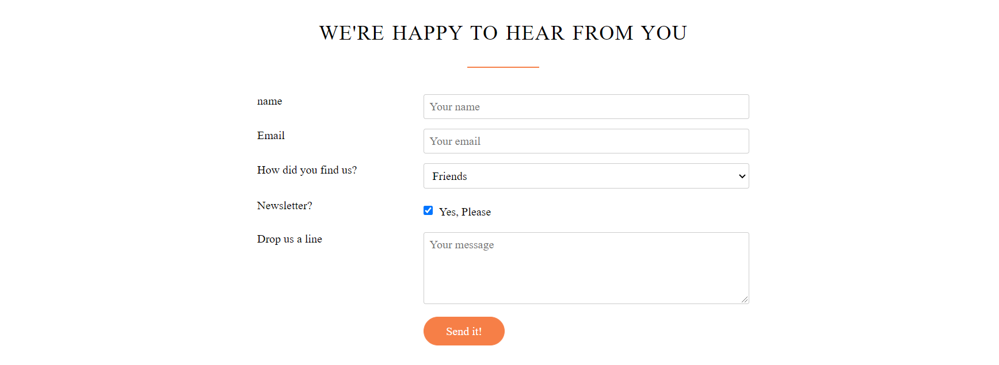
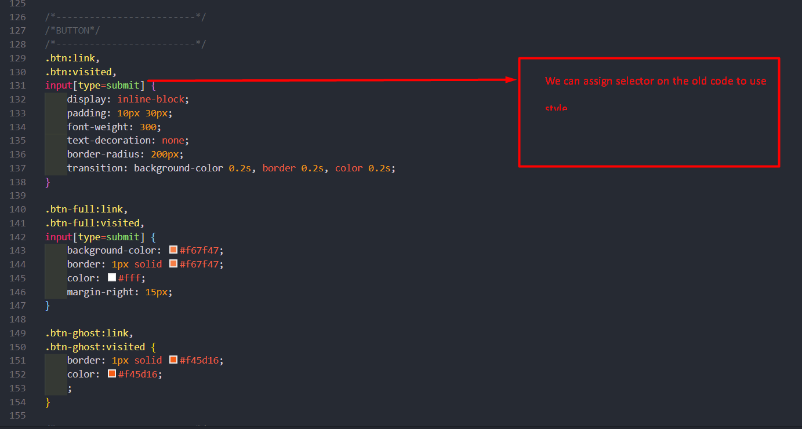

# Restaurants Project 📃🏆

## Table of contents 📂

* [Restaurants Project 📃🏆](#restaurants-project-)
  + [Table of contents 📂](#table-of-contents-)
    - [The 7 real-world steps to a fully functional website 🔥](#the-7-real-world-steps-to-a-fully-functional-website-)
    - [✏️ setup project](#️-setup-project)
    - [✏️ What we will learn in this project](#️-what-we-will-learn-in-this-project)
    - [✏️ Header background](#️-header-background)
    - [✏️ How to make a button and hover effect](#️-how-to-make-a-button-and-hover-effect)
      - [html](#html)
      - [css](#css)
      - [Icon](#icon)
      - [How to create underline and center](#how-to-create-underline-and-center)
      - [transition scale](#transition-scale)
    - [✏️ How to make section-features](#️-how-to-make-section-features)
      - [css](#css-1)
    - [✏️ Bulding the cities](#️-bulding-the-cities)
    - [✏️ Customer Testimonials](#️-customer-testimonials)
    - [✏️section plan price](#️section-plan-price)
    - [section form](#section-form)
    - [Footer](#footer)

### The 7 real-world steps to a fully functional website 🔥

1. Define your project
2. Plan out everything
3. Sketch your ideas before you design
4. Design and develop your website
5. It's not done yet: optimization
6. Launch the masterpiece
7. Site maintenance

### ✏️ setup project


### ✏️ What we will learn in this project

* html, header, nave, ul, li
* put text on an image: make image darker
* How to make that image as high as the browser iewport
* How to male a vertically a norizontally centered box
* How to design buttons

### ✏️ Header background

**How to put image background**

``` css
header {
    background-image: linear-gradient(rgba(0, 0, 0, 0.7), rgba(0, 0, 0, 0.7)), url(/02_restaurants/assest/resources/img/hero.jpg);
    background-size: cover;
    background-position: center;
    height: 100vh;
    background-attachment: fixed;
    /* The background is will fixed on the page when user scroll down or up. That is an animation website */
}
```

**Note**
This code for create background shadow with linear-gradient 
 `leniear-gradient(rgba(value 1),rgba(value 2))`
**How to set text center**

``` css
.hero-text-box {
    position: absolute;
    width: 1140px;
    top: 50%;
    left: 50%;
    transform: translate(-50%, -50%);
}
```

**Result**


### ✏️ How to make a button and hover effect

**Note :** 

* a:link = เชื่อมโยง  
* a:visited =  มาเยือน
* a:hover = เลื่อนเมาส์ใกล้
* a:active = การใช้งาน

#### html

``` html
 <header>
     <a class="btn btn-full" href="#">I’m hungry</a>
     <a class="btn btn-ghost" href="#">Show me more</a>
 </header>
```

1. สร้าง Element html ที่เราต้องการ ในที่นี่ใช้ Tag a เพื่อเป็นการคลิกเพื่อ Link ไปยังหน้าที่ต้องการ
2. สร้าง class ให้กับ Element ที่เราต้องการตกแต่ง ในที่นี่ใช้ btn
3. สร้าง child Element ที่เราต้องการตกแต่งให้ต่างจากที่มีอยู่ ในที่นี่ใช้ btn-full, btn-ghost
4. กำหนดค่าต่างๆ ให้กับ Hover ว่าต้องการให้  Hover ทำงานอย่างไร 

#### css 

`class="btn"` เพื่อเป็นการห่อหุ้มและการตกแต่งเบื้องต้น 

``` css
.btn:link,
.btn:visited {
    display: inline-block;
    padding: 10px 30px;
    font-weight: 300;
    text-decoration: none;
    border-radius: 200px;
    transition: background-color 0.2s, border 0.2s, color 0.2s;
}
```

`class="btn-full"` and `class="btn-ghost"` จะเป็นการกำหนดค่าให้กับ btn ต่างๆ ว่ามีขนาดเท่าไหร่ สีอะไร 

``` css
.btn-full:link,
.btn-full:visited {
    background-color: #f67f47;
    border: 1px solid #f67f47;
    color: #fff;
    margin-right: 15px;
}

.btn-ghost:link,
.btn-ghost:visited {
    border: 1px solid #f45d16;
    color: #f45d16;
}
```

`.btn:hover` เมื่อเราเอาเมาส์ไปคลิเราต้องการให้มีสีที่เปลี่ยนแปลง และมีการหน่วงระยะเวลาเพิ่มขึ้นเพื่อความสวยงาม

``` css
/*----------BUTTON HOVER----------*/
.btn:hover,
.btn:active {
    background-color: #f45d16;
}

.btn-full:hover,
.btn-full:active {
    background-color: #f45d16;
    border: 1px solid #f45d16;
    color: #fff;
}

.btn-ghost:hover,
.btn-ghost:active {
    background-color: #f45d16;
    border: 1px solid #f45d16;
    color: #fff;
}
```

#### Icon

[Ionicons](https://ionicons.com/v2/#cdn)

1. Install icon or link like CDN from the website
2. choose the icon on the website and get that class element

   
**Example code**

``` html
<div class="col span-1-of-4 box">
    <i class="icon-big ion-ios-stopwatch-outline"></i>
    <h3>Ready in 20 minutes</h3>
    <p>
        You're only twenty minutes away from your delicious and super healthy meals delivered right to your
        home. We work with the best chefs in each town to ensure that you're 100% happy.
    </p>
</div>
```

**optimization with css**

``` css 
.icon-big {

    font-size: 350%;
    display: block;
    color: #f67f47;

}

``` 

#### How to create underline and center

``` css
h2 {
    font-size: 180%;
    word-spacing: 2px;
    text-align: center;
    margin-bottom: 30px;
}

/* Underline  */
h2:after {
    display: block;
    height: 2px;
    background-color: #f67f47;
    content: "";
    width: 100px;
    margin: 0 auto;
    margin-top: 30px;
}
```

#### transition scale

``` css
.meal-photo {
    width: 100%;
    margin: 0;
    overflow: hidden;
    background-color: black;
}

/* Transition scale */
.meal-photo img {
    opacity: 0.7;
    width: 100%;
    height: auto;
    transform: scale(1.15);
    transition: transform 1s, opacity 0.5s;
}

.meal-photo img:hover {
    opacity: 1;
    transform: scale(1.03);
}
```

### ✏️ How to make section-features

```html 
<section class="section-features">

        <div class="row">
            <h2>Get good fast &mdash; not fast food</h2>
            <p class="long-copy">Hello, we’re Omnifood, your new premium food delivery service. We know you’re always
                busy. No time for cooking. So let us take care of that, we’re really good at it, we promise!</p>
        </div>

        <div class="row">
            <div class="col span-1-of-4 box">
                <i class="icon-big ion-ios-infinite"></i>
                <h3>Up to 365 days/year</h3>
                <p>
                    Never cook again! We really mean that. Our subscription plans include up to 365 days/year coverage.
                    You can also choose to order more flexibly if that's your style.
                </p>
            </div>
            <div class="col span-1-of-4 box">
                <i class="icon-big ion-ios-stopwatch-outline"></i>
                <h3>Ready in 20 minutes</h3>
                <p>
                    You're only twenty minutes away from your delicious and super healthy meals delivered right to your
                    home. We work with the best chefs in each town to ensure that you're 100% happy.
                </p>
            </div>
            <div class="col span-1-of-4 box">
                <i class="icon-big ion-ios-nutrition-outline"></i>
                <h3>100% organic</h3>
                <p>
                    All our vegetables are fresh, organic and local. Animals are raised without added hormones or
                    antibiotics. Good for your health, the environment, and it also tastes better!
                </p>
            </div>
            <div class="col span-1-of-4 box">
                <i class="icon-big ion-ios-cart-outline"></i>
                <h3>Order anything</h3>
                <p>
                    We don't limit your creativity, which means you can order whatever you feel like. You can also
                    choose from our menu containing over 100 delicious meals. It's up to you!
                </p>
            </div>
        </div>
    </section>

``` 

#### css

```css
/*-------------------------*/
/*Section Feature*/
/*-------------------------*/
.long-copy {
    line-height: 145%;
    width: 70%;
    margin-left: 15%;
}

.box {
    padding: 0;
}

.box p {
    font-size: 100%;
    line-height: 145%;
}

.section-features .long-copy {
    margin-bottom: 30px;
}
```

> ⚠️ Warring : This is very important!  
>  
> Whenever we use float: left or right. We must use clear: both; immediately in the next element.  

### ✏️ Bulding the cities

* Create section class cities for content all the feature
* create class row for defind the position in center
* col span-1-of-4 for defind 4 pictures in 1 colum

``` html
<section class="cities">
    <div class="row">
        <h2>We're currently in these cities</h2>
    </div>

    <div class="row">
        <!-- 1 -->
        <div class="col span-1-of-4 box">
            
            <h3>Lisbon</h3>
            <div class="city-feature">
                <i class="ion-android-person"></i>
                1600+ happy eaters
            </div>
            <div class="city-feature">
                <i class="ion-android-star"></i>
                60+ top chefs
            </div>
            <div class="city-feature">
                <i class="ion-social-twitter"></i>
                @omnifood_lx
            </div>
        </div>
        <!-- 2 -->
        <div class="col span-1-of-4 box">
            
            <h3>San Francisco</h3>
            <div class="city-feature">
                <i class="ion-android-person"></i>
                3700+ happy eaters
            </div>
            <div class="city-feature">
                <i class="ion-android-star"></i>
                160+ top chefs
            </div>
            <div class="city-feature">
                <i class="ion-social-twitter"></i>
                @omnifood_sf
            </div>
        </div>
        <!-- 3 -->
        <div class="col span-1-of-4 box">
            
            <h3>Berlin</h3>
            <div class="city-feature">
                <i class="ion-android-person"></i>
                2300+ happy eaters
            </div>
            <div class="city-feature">
                <i class="ion-android-star"></i>
                110+ top chefs
            </div>
            <div class="city-feature">
                <i class="ion-social-twitter"></i>
                @omnifood_berlin
            </div>
        </div>
        <!-- 4 -->
        <div class="col span-1-of-4 box">
            
            <h3>London</h3>
            <div class="city-feature">
                <i class="ion-android-person"></i>
                1200+ happy eaters
            </div>
            <div class="city-feature">
                <i class="ion-android-star"></i>
                50+ top chefs
            </div>
            <div class="city-feature">
                <i class="ion-social-twitter"></i>
                @omnifood_london
            </div>
        </div>
    </div>
</section>
```

use this code for defind size of picturs

``` css
.box img {
    width: 100%;
    height: auto;
    margin-bottom: 15px;
}
```

icon  

``` css
.icon-small {
    display: inline-block;
    width: 30px;
    text-align: center;
    color: #f67f47;
    font-size: 120%;
    margin-right: 10px;

    /* secerts to align text and icons */
    line-height: 120%;
    vertical-align: middle;
    margin-top: -4px;
}
```

link:hover

``` css
/* Link */
.city-feature a:link,
.city-feature a:visited {
    color: #f67f47;
    text-decoration: none;
    padding-bottom: 1px;
    border-bottom: 1px solid #f67f47;
    transition: border-bottom 0.2s, color 0.2s;
}

/* Hover */
.city-feature a:hover,
.city-feature a:active {
    color: #555;
    border-bottom: 1px solid transparent
}
```

### ✏️ Customer Testimonials 

``` html
<blockquote>
    Omnifood is just awesome! I just launched a startup which leaves me with no time for cooking, so
    Omnifood is a life-saver. Now that I got used to it, I couldn't live without my daily meals!
    <cite>Alberto Duncan</cite>
</blockquote>
```

`<cite>Alberto Duncan</cite>` This is auther from the blockquote

Create background for there eliment  

> `background-attachment: fixed;` The background is will fixed on the page when user scroll down or up. That is an animation website 
> It is very beautiful when we use this one!

``` css
.section-testimonials {
    background-image: linear-gradient(rgba(0, 0, 0, 0.7), rgba(0, 0, 0, 0.7)), url(/02_restaurants/assest/resources/img/back-customers.jpg);
    background-size: cover;
    color: #fff;
    background-attachment: fixed;
    /* The background is will fixed on the page when user scroll down or up. That is an animation website */
}
```

Blockquote

``` css
blockquote {
    padding: 2%;
    font-style: italic;
    font-size: 110%;
    line-height: 145%;
    position: relative;
    margin-top: 40px;
}

blockquote:before {
    position: absolute;
    content: "\201c";
    font-size: 400%;
    display: block;
    top: 5px;
    left: -30px;
}

cite {
    font-size: 90%;
    margin-top: 25px;
    display: block;

}

cite img {
    height: 45px;
    border-radius: 50px;
    margin-right: 10px;
    vertical-align: middle;
    /* How to center when I use display block */
}
```

### ✏️section plan price

``` html
<section class="section-plans">
    <div class="row">
        <h2>Start eating healthy today</h2>
    </div>
    <div class="row">
        <div class="col span-1-of-3">
            <div class="plan-box">
                <div>
                    <h3>Premium</h3>
                    <p class="plan-price">$399 <span>/ month</span></p>
                    <p class="plan-price-meal">That's only 13.30$ per meal</p>
                </div>
                <div>
                    <ul>
                        <li><i class="ion-ios-checkmark-empty icon-small"></i>1 meal every day</li>
                        <li><i class="ion-ios-checkmark-empty icon-small"></i>Order 24/7</li>
                        <li><i class="ion-ios-checkmark-empty icon-small"></i>Access to newest creations</li>
                        <li><i class="ion-ios-checkmark-empty icon-small"></i>Free delivery</li>
                    </ul>
                </div>
                <div>
                    <a href="#" class="btn btn-full">Sign Up now</a>
                </div>
            </div>
        </div>
    </div>
    </div>
</section>
```

``` css
.section-plans {
    background: #f4f4f4;
}

.plan-box {
    background-color: #fff;
    border-radius: 10px;
    width: 90%;
    margin-left: 5%;
    box-shadow: 0 2px 2px #d1cccc;
}

.plan-box div {
    padding: 15px;
    border-bottom: 1px solid rgb(241, 241, 241)
}

.plan-box div:first-child {
    background-color: #f45d16;
    color: #fff;
    border-top-left-radius: 10px;
    border-top-right-radius: 10px;
}

.plan-box div:last-child {
    text-align: center;
    border: 0;
}

.plan-price {
    font-size: 300%;
    margin-bottom: 10px;
    font-weight: 100;
    color: #fff;
}

.plan-price span {
    font-size: 30%;
    font-weight: 300;
}

.plan-price-meal {
    font-size: 80%;
}

.plan-box ul {
    list-style: none;
}

.plan-box ul li {
    padding: 5px 0;
}
```

### section form 

``` html
<section class="section-form">
    <div class="row">
        <h2>We're happy to hear from you</h2>
    </div>
    <div class="row">
        <form class="contact-form" method="post" action="#">
            <div class="row">
                <div class="col span-1-of-3">
                    <label for="name">name</label>
                </div>
                <div class="col span-2-of-3">
                    <input type="text" name="name" id="name" placeholder="Your name " required>
                </div>
            </div>
            <div class="row">
                <div class="col span-1-of-3">
                    <label for="email">Email</label>
                </div>
                <div class="col span-2-of-3">
                    <input type="email" name="email" id="email" placeholder="Your email " required>
                </div>
            </div>
            <div class="row">
                <div class="col span-1-of-3">
                    <label for="find-us">How did you find us?</label>
                </div>
                <div class="col span-2-of-3">
                    <select name="find-us" id="find-us">
                        <option value="friends" selected>Friends</option>
                        <option value="ad">Search engine</option>
                        <option value="ad">Advertisement</option>
                        <option value="other">Other</option>
                    </select>
                </div>
            </div>
            <div class="row">
                <div class="col span-1-of-3">
                    <label for="#">Newsletter?</label>
                </div>
                <div class="col span-2-of-3">
                    <input type="checkbox" name="news" id="news" checked> Yes, Please
                </div>
            </div>
            <div class="row">
                <div class="col span-1-of-3">
                    <label>Drop us a line</label>
                </div>
                <div class="col span-2-of-3">
                    <textarea name="message" placeholder="Your message" cols="30" rows="10"></textarea>
                </div>
            </div>
            <div class="row">
                <div class="col span-1-of-3">
                    <label for="#">&nbsp;</label>
                </div>
                <div class="col span-2-of-3">
                    <input type="submit" value="Send it!">
                </div>
            </div>
        </form>
    </div>
</section>
```

``` css
.contact-form {
    width: 60%;
    margin: 0 auto;
}

input[type=text],
input[type=email],
select,
textarea {
    width: 100%;
    padding: 7px;
    border-radius: 3px;
    border: 1px solid #ccc;
}

textarea {
    height: 100px;
}

input[type=checkbox] {
    margin: 10px 5px 10px 0;
}

*:focus {
    outline: none;
}
```



We can use same style by the old code. 



### Footer 

``` html
<footer>
    <div class="row">
        <div class="col span-1-of-2">
            <ul class="footer-nav">
                <li><a href="#">About us</a></li>
                <li><a href="#">Blog</a></li>
                <li><a href="#">Press</a></li>
                <li><a href="#">iOS app</a></li>
                <li><a href="#">Android app</a></li>
            </ul>
        </div>
        <div class="col span-1-of-2">
            <ul class="socail-links">
                <li><a href="#"><i class="ion-social-facebook"></i></a></li>
                <li><a href="#"><i class="ion-social-twitter"></i></a></li>
                <li><a href="#"><i class="ion-social-googleplus"></i></a></li>
                <li><a href="#"><i class="ion-social-instagram"></i></a></li>
            </ul>
        </div>
    </div>
    <div class="row">
        <p>
            Copyright &copy; 2020 by the Restuarant. All rights reserved
        </p>
    </div>
</footer>
```

``` css
footer {
    background-color: #333;
    padding: 20px;
    font-size: 120%;
}

.footer-nav {
    list-style: none;
    float: left;
}

.socail-links {
    list-style: none;
    float: right;
}

.footer-nav li,
.socail-links li {
    display: inline-block;
    margin-right: 20px;
}

.footer-nav li:last-child,
.socail-links li:last-child {
    margin-right: 0;
}

.footer-nav li a:link,
.footer-nav li a:visited,
.socail-links li a:link,
.socail-links li a:visited {
    text-decoration: none;
    border: 0;
    color: #888;
    transition: transform color 0.2s;
}

.footer-nav li a:hover,
.footer-nav li a:active {
    color: #ddd;
}

.social-links li a:link,
.social-links li a:visited {
    font-size: 180%;
}

.ion-social-facebook,
.ion-social-twitter,
.ion-social-googleplus,
.ion-social-instagram {
    transition: color 0.2s;
}

.ion-social-facebook:hover {
    color: #3b5999;
}

.ion-social-twitter:hover {
    color: #55acee;
}

.ion-social-googleplus:hover {
    color: #dd4b39;
}

.ion-social-instagram:hover {
    color: #e4405f;
}

footer p {
    clear: both;
    color: #888;
    text-align: center;
    font-size: 90%;
    margin-top: 30px;
}
```
