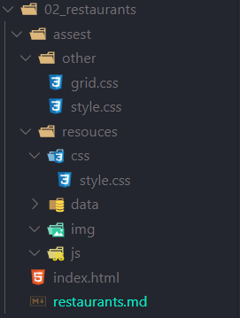

# Restaurants Project

## Table of contents

- [Restaurants Project](#restaurants-project)
  - [Table of contents](#table-of-contents)
    - [The 7 real-world steps to a fully functional website](#the-7-real-world-steps-to-a-fully-functional-website)
    - [setup project](#setup-project)
    - [What we will learn in this project](#what-we-will-learn-in-this-project)
    - [Header background](#header-background)

### The 7 real-world steps to a fully functional website

1. Define your project
2. Plan out everything
3. Sketch your ideas before you design
4. Design and develop your website
5. It's not done yet: optimization
6. Launch the masterpiece
7. Site maintenance

### setup project



### What we will learn in this project

* html, header, nave, ul, li
* put text on an image: make image darker
* How to make that image as high as the browser iewport
* How to male a vertically a norizontally centered box
* How to design buttons

### Header background

**How to put iamge background**

``` css
header {
    background-image: linear-gradient(rgba(0, 0, 0, 0.7), rgba(0, 0, 0, 0.7)), url(/02_restaurants/assest/resouces/img/hero.jpg);
    background-size: cover;
    background-position: center;
    height: 100vh;
    color: #ffffff;
}
```

**How to set text center**

``` css
.hero-text-box {
    position: absolute;
    width: 1140px;
    top: 50%;
    left: 50%;
    transform: translate(-50%, -50%);
}
```

**Result**


