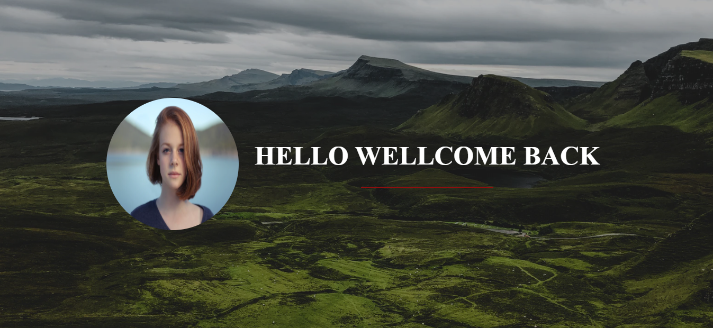

# Hero page workshop 🔥

## This is a workshop about hero page 📑

After I learned in the last lecture. I have got a lot of ideas to create my workshop so this one is my workshop.  
What I do in this workshop. Please see the below. 👇
*** 

### Table of contens 📁

* [HTML](#html)
* [CSS](#CSS)


### HTML

``` html
    <header>
        <div class="flex-container">
            
            <h1>Hello wellcome back</h1>
        </div>
    </header>
```

1. Create element hearder to content the main value and background
2. Create `<div class="flex-container">` to difind container
3. Create element img to put the picture
4. Create element `<h1>Hello wellcome back</h1>` to difind the text into it.  

For this workshop I have used the pictures from [https://unsplash.com/](https://unsplash.com/) I'm really thank 🙏

### CSS

``` css
Setting page * {

    padding: 0;
    margin: 0;
    box-sizing: border-box;
}
```

Background-image

``` css
header {
    background-image: linear-gradient(rgba(0, 0, 0, 0.3), rgba(0, 0, 0, 0.3)), url('https://images.unsplash.com/photo-1589807867661-30cd86bd2c29?ixlib=rb-1.2.1&ixid=eyJhcHBfaWQiOjEyMDd9&auto=format&fit=crop&w=1567&q=80');
    background-size: cover;
    background-position: center;
    height: 100vh;
}
```

Flex-container is defind that someting contain it and there are direction.  

``` css
.flex-container {
    display: flex;
    justify-content: center;
    align-items: center;
    height: 100vh;
}
```

img

``` css
.img-wellcome-page {
    border-radius: 50%;
    height: 250px;
    width: 250px;
}
```

h1

``` css
h1 {
    color: #fff;
    font-size: 50px;
    text-transform: uppercase;
    margin-left: 30px;
}

/* This code for create underline */
h1:after {
    display: block;
    height: 2px;
    background-color: rgb(143, 14, 14);
    content: '';
    width: 250px;
    margin: 0 auto;
    margin-top: 30px;
}
```
This is my result
