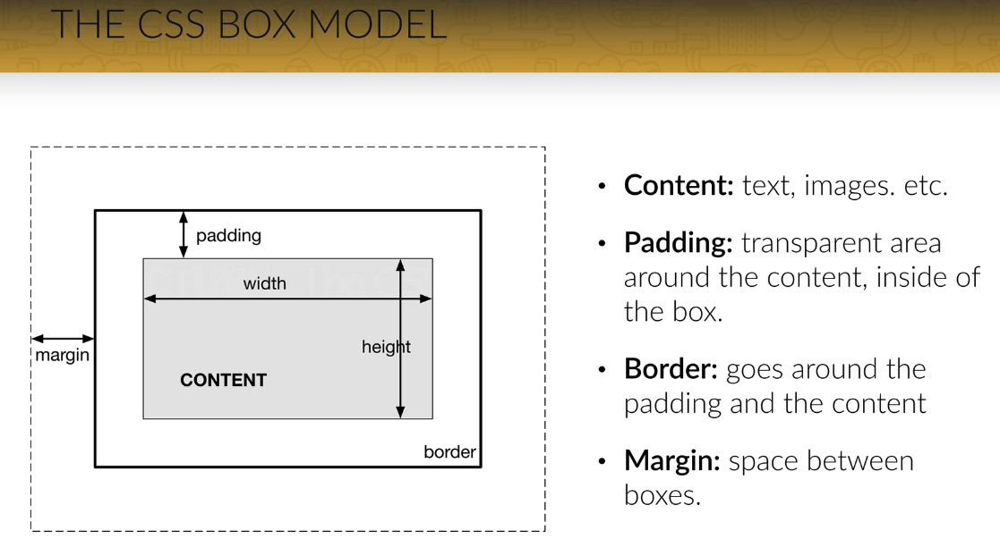
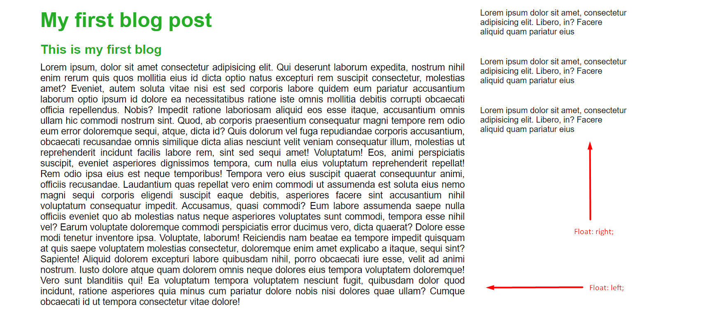
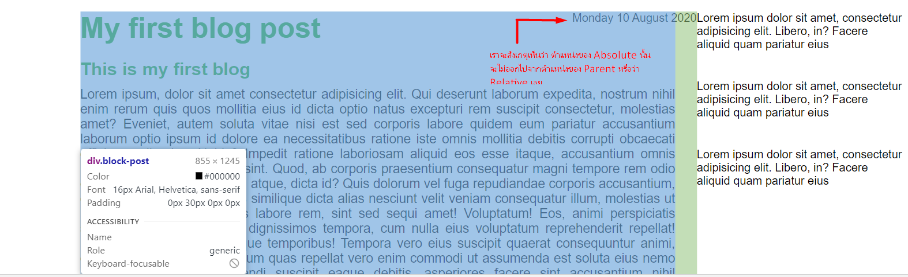
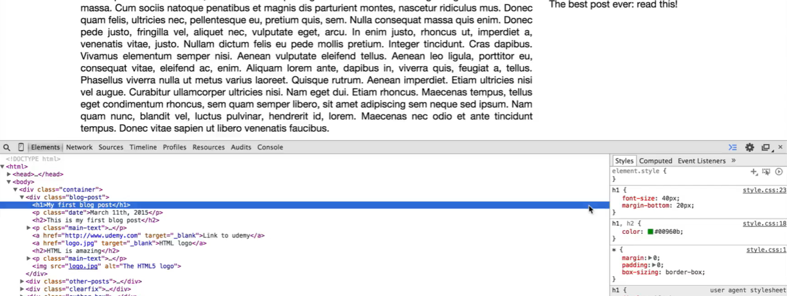
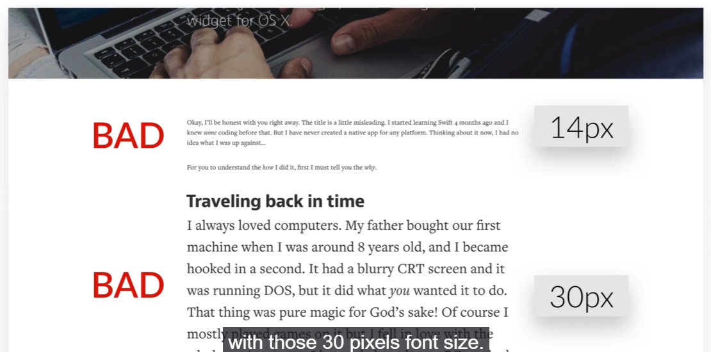
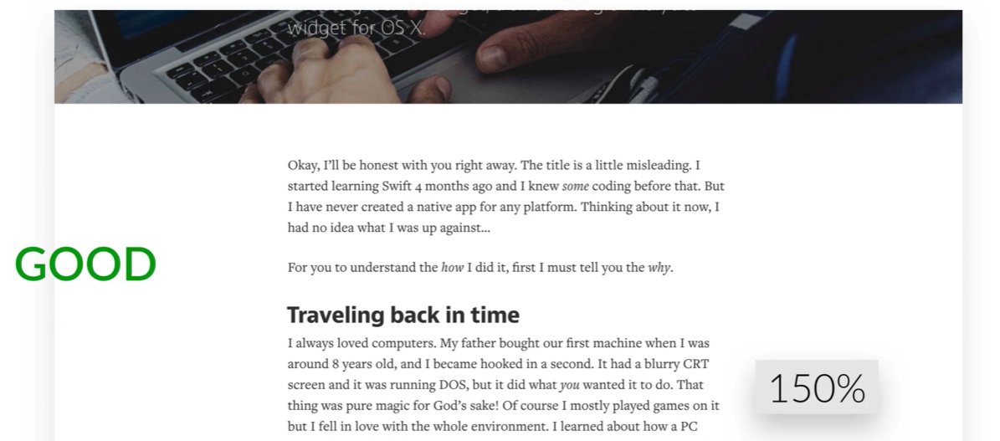
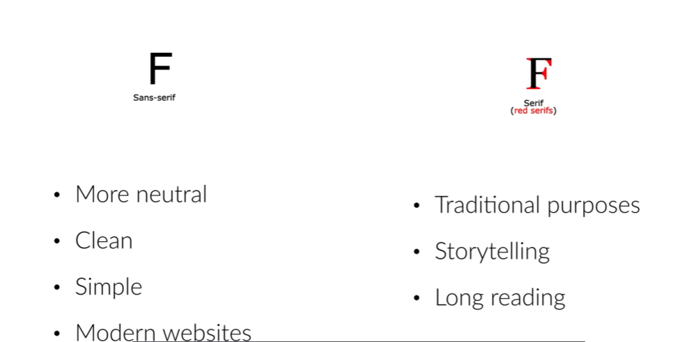

# Build Responsive Real World Websites with HTML5 and CSS3

## Table of contents

- [HTML](#html)
- [CSS](#css)
- [Web design](#web-design)

## HTML

- Headding
- paragraph
- footer

---

## CSS

- How to use css
  - inline style // เขียนลงไปที่ Element html ได้โดยตรง
  - internal Style // เขียน CSS อยู่ตรงส่วนของ head
  - Externail style // link css มาจากไฟล์ภายนอก

### Color

- Hex **_instance_** `#532123`
- rgb เป็นการผสมสีจากแม่สี
- rgba เป็นการเลือกสีได้เหมือน rgb ที่สามารถเลือกความโปร่งแสงของสีได้ **_instance_** `rgba(201, 112, 44, 1)`

### Class and ID

- class สามารถใช้งานได้หลาย Element
- Id สามารถใช้งานได้เพียง Element เดียวเท่านั้น

### CSS box model



### CSS Layout - The display Property

- Block-level Elements
  - `<div>`
  - `<h1> - <h6>`
  - `<p>`
  - `<form>`
  - `<header>`
  - `<footer>`
  - `<section>`
- Inline Elements
  - `<span>`
  - `<a>`
  - ``
- Margin
  - `margin-top: value;`
  - `margin-right: value;`
  - `margin-bottom: value;`
  - `margin-left: value;`
  - `margin: top right bottom left;`
- Padding
  - `padding-top: value;`
  - `padding-right: value;`
  - `padding-bottom: value;`
  - `padding-left: value;`
  - `padding: top right bottom left;`

> วิธีที่ง่ายที่สุดในการจัดตำแหน่งคือ การใส่สีให้กับ background แต่ละ div ก่อน แล้วค่อยลบออกทีหลัง

### Float

Float คือการจัดตำแหน่งของ Box ที่เราต้องการว่าให้อยู่ในตำแหน่งหรือว่าทิศทางใด เช่นต้องการให้อยู่ทางด้าน ซ้าย หรือว่า ขวา

- `Float: left;` อยู่ทางซ้ายของหน้าจอ
- `float: right;` อยู่ทางของขวาหน้าจอ

ทุกครั้งที่เราใช้คำสั่ง float เราจะต้องใช้คำสั่ง clear: both; ใน Element ถัดไปด้วยเสมอเพื่อไม่ให้วัตถุนั้น Float ไปตามค่าก่อนหน้า  
หรือว่า จะใช้อีกวีธีหนึ่งคือการสร้าง div ขึ้นมารองรับ clear: both; โดยตรงได้เลย

**_Example_**

```html
<div class="clearfix"></div>
```

```css
.clearfix:after {
  content: '';
  display: table;
  clear: both;
}
```



### Relative and Absolute

**_Relative_**  
การแสดงผลของ position: relative; จะแสดงผลต่อจาก ณ จุดที่มันอยู่ตรงนั้น “แบบตรงไปตรงมา” ซึ่ง position: relative; สามารถระบุค่าจุด x, y ให้มันได้

**_Absolute_**  
การแสดงผลของ position: absolute; จะแสดงผลเป็น “อิสระ” คือจะให้มันไปอยู่ตรงไหนก็ได้ ซึ่งมันจะอยู่แค่ภายใต้ element ที่ครอบมันอีกทีเท่านั้น (ถ้ากำหนดแบบไม่มีอะไรมาครอบ ก็ให้คิดว่า body นั่นแหละที่ครอบมัน)

ขั้นตอนการจัดตำแหน่ง Absolute

1. หาตำแหน่ง parent ให้กับ Absolute ก่อน ตามตัวอย่างคือ `div class="blog-post"` นั้นเอง
2. จากนั้น ระบุค่า `position: relative;` ให้กับ `div class="blog-post"`
3. จากนั้นก็กำหนด `position: absolute;` ให้กับ child element ของ `div class="blog-post"`
   **_Example Code_**

```html
<div class="block-post">
  <p class="date">Monday 10 August 2020</p>
</div>
```

```css
.block-post {
  width: 75%;
  float: left;
  padding-right: 30px;
  position: relative;
}

.date {
  position: absolute;
  top: 20px;
  right: 30px;
}
```



---

### Google developer Tools

Inspect เอาไว้สำหรับตรวจเช็ค Element ที่เราต้องการ เราสามารถตรวจเช็คได้ว่า Element นั้นมี Property หรือว่า Value อะไร เช่น

- header
- navbar
- padding
- margin



---

## Web design

### Typography

1. Use a font-size between 15 and 25 pixels  
   if the font-size smaller than 14 pixels and biger than 30 pixels is not unnature



2. Use really big font-size for headline


3. Make the website easy to read by line spacing between 120 and 150%



4. 45 to 90 Characters per lines
5. use good font



### Use colors like a pro

1. Use only color one base color
2. Use tools if you want to use different color
3. use color to draw attention
4. never use back color for wweeb design
5. choose colors wisely

### Image

1. Put text directly on the image
2. Overlay the image
3. Put your text in a box
4. Blur the image
5. The floor fade

### Icon

1. Use icons to list features/steps
2. Use icons for actions and links
3. Icons should be recognizable
4. Label your icons
5. Icons should not take a center stage
6. Use icon fonts whenever possible

### Spacing and Layout

1. Put whitespace between your elements
2. Put whitespace between your groups of elements
3. Put whitespace between you website's sections
4. Define where you want your audience to look first
5. Establish a flow that corresponds to your content's message
6. Use whitespace to build that flow

### Getting insprired

1. Collect designs that you like
2. Try to understand everything about them
3. Why do they good look
4. What do these sites have in common
5. How were they build in HTML and CSS

### The 7 real-world steps to a fully functional website

1. Define your project

Start off by defining the goal of your project. This can be showing your portfolio to the world, selling an e-book, building a blog, etc.
Also define your audience. Ask yourself: which is the typical user that will visit my website?
This is important, because you should always design with your goal and audience in mind.

2. Plan out everything

Once your project is defined, plan your content carefully. This includes text, images, videos, icons, etc.
Remember what I told you about visual hierarchy. It plays an important role when you start thinking about what you want on your website and what you don't. Defining the content before actually starting the design is called the content-first approach. It means that you should design for the content, instead of designing a webpage and then filling it with some stuff.
Define the navigation.
Define the site structure. You can draw a sitemap in this step if we're talking about a bigger project.

3. Sketch your ideas before you design

Now it's time to get inspired and think about your design.
Then, get the ideas out of your head. And with that I mean that you should sketch your ideas before you start designing. It will help you explore ideas and create a concept of what you want to build. Using pencil and paper is a great way of quickly retaining your valuable ideas.
Make as many sketches as you want, but don't spend too much time perfecting anything. Once you have an initial idea, you can concentrate on the details when designing in HTML and CSS.
I advise you to never, ever start designing without having an idea of what you want to build. Getting inspiration is very important in this phase, and I already told you how to do that!

4. Design and develop your website

After sketching, start to design your website using all the guidelines and tips you've learned in the web design section.
You'll do that using HTML and CSS, which is called designing in the browser. Designing in the browser is basically designing and developing at the same time.
There are more and more designers leaving traditional design programs such as Photoshop and start designing in the browser. The biggest reason for this is that you can't design responsive websites in photoshop. It also saves you tons of time.
In this phase, you'll use your sketches, content and planning decisions you've made in steps 1, 2 and 3.

5. It's not done yet: optimization

Before you can actually launch your beautiful masterpiece for the world to see it, we have to optimize its performance in terms of site speed.
You also need to do some basic search engine optimization (SEO) for search engines such as google.

6. Launch the masterpiece

Your optimized website is now finally ready to launch.
All you need for launching is a webserver that will host your website and deliver it to the world.

7. Site maintenance

The launch of your website is not the end of the story.
Now it's time to monitor your users' behavior and make some changes to your website if necessary.
You should also update your content regularly in order to show your users that your website is alive! For instance, a blog can be a great way of doing that.
