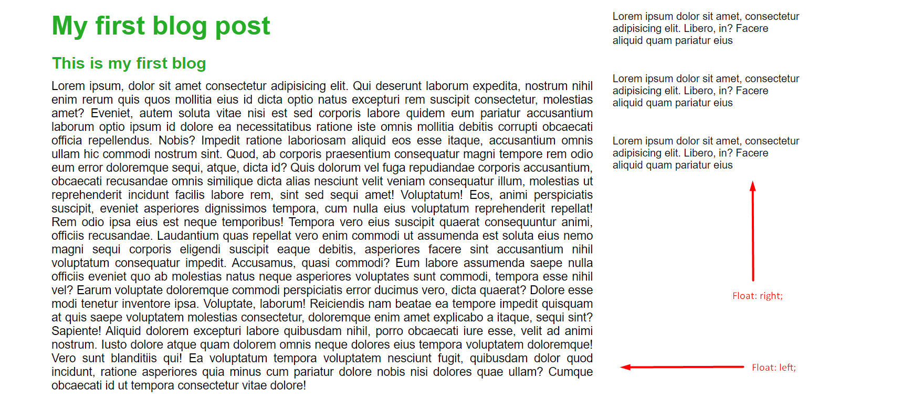
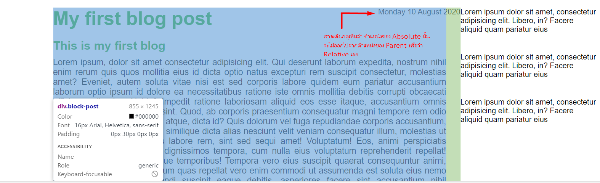
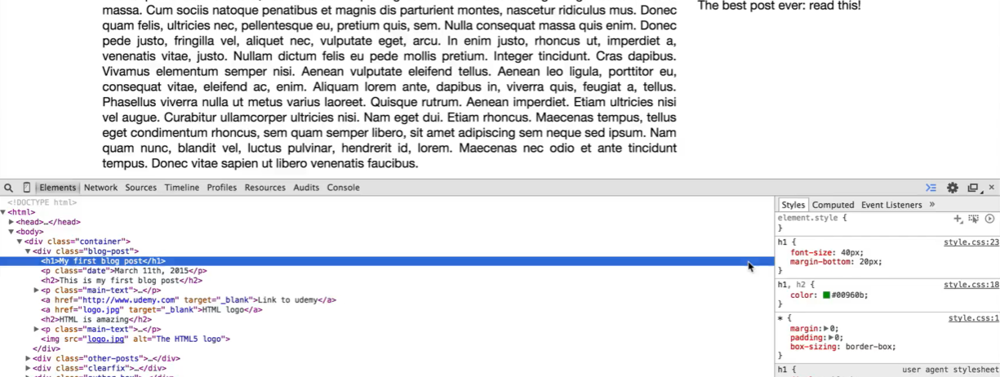

# Build Responsive Real World Websites with HTML5 and CSS3

## Table of contents

* [HTML](#html)
* [CSS](#css)

### HTML

* Headding
* paragraph
* footer

### CSS

* How to use css  
  * inline style // เขียนลงไปที่ Element html ได้โดยตรง  
  * internal Style // เขียน CSS อยู่ตรงส่วนของ head  
  * Externail style // link css มาจากไฟล์ภายนอก  

#### Color

* Hex ***instance*** `#532123`
* rgb เป็นการผสมสีจากแม่สี
* rgba เป็นการเลือกสีได้เหมือน rgb ที่สามารถเลือกความโปร่งแสงของสีได้ ***instance*** `rgba(201, 112, 44, 1)`

#### Class and ID

* class สามารถใช้งานได้หลาย Element  
* Id สามารถใช้งานได้เพียง Element เดียวเท่านั้น

#### CSS box model


#### CSS Layout - The display Property

* Block-level Elements
  * `<div>`
  * `<h1> - <h6>`
  * `<p>`
  * `<form>`
  * `<header>`
  * `<footer>`
  * `<section>`
* Inline Elements
  * `<span>`
  * `<a>`
  * ``
* Margin
  * `margin-top: value;`
  * `margin-right: value;`
  * `margin-bottom: value;`
  * `margin-left: value;`
  * `margin: top right bottom left;`
* Padding
  * `padding-top: value;`
  * `padding-right: value;`
  * `padding-bottom: value;`
  * `padding-left: value;`
  * `padding: top right bottom left;`
  
> วิธีที่ง่ายที่สุดในการจัดตำแหน่งคือ การใส่สีให้กับ background แต่ละ div ก่อน แล้วค่อยลบออกทีหลัง  

#### Float

Float คือการจัดตำแหน่งของ Box ที่เราต้องการว่าให้อยู่ในตำแหน่งหรือว่าทิศทางใด เช่นต้องการให้อยู่ทางด้าน ซ้าย หรือว่า ขวา  

* `Float: left;` อยู่ทางซ้ายของหน้าจอ
* `float: right;` อยู่ทางของขวาหน้าจอ

ทุกครั้งที่เราใช้คำสั่ง float เราจะต้องใช้คำสั่ง clear: both; ใน Element ถัดไปด้วยเสมอเพื่อไม่ให้วัตถุนั้น Float ไปตามค่าก่อนหน้า  
หรือว่า จะใช้อีกวีธีหนึ่งคือการสร้าง div ขึ้นมารองรับ  clear: both; โดยตรงได้เลย

***Example***

``` html
    <div class="clearfix"></div>
```

``` css
    .clearfix:after {
        content: "";
        display: table;
        clear: both;
    }
```



#### Relative and Absolute  

***Relative***  
การแสดงผลของ position: relative; จะแสดงผลต่อจาก ณ จุดที่มันอยู่ตรงนั้น “แบบตรงไปตรงมา” ซึ่ง position: relative; สามารถระบุค่าจุด x, y ให้มันได้  

***Absolute***  
การแสดงผลของ position: absolute; จะแสดงผลเป็น “อิสระ” คือจะให้มันไปอยู่ตรงไหนก็ได้ ซึ่งมันจะอยู่แค่ภายใต้ element ที่ครอบมันอีกทีเท่านั้น (ถ้ากำหนดแบบไม่มีอะไรมาครอบ ก็ให้คิดว่า body นั่นแหละที่ครอบมัน)  

ขั้นตอนการจัดตำแหน่ง Absolute  

1. หาตำแหน่ง parent ให้กับ Absolute ก่อน ตามตัวอย่างคือ `div class="blog-post"` นั้นเอง  
2. จากนั้น ระบุค่า `position: relative;` ให้กับ `div class="blog-post"`
3. จากนั้นก็กำหนด `position: absolute;` ให้กับ child element ของ `div class="blog-post"`
***Example Code***  

``` html
  <div class="block-post">
      <p class="date"> Monday 10 August 2020</p>
  </div>
```

``` css
.block-post {
    width: 75%;
    float: left;
    padding-right: 30px;
    position: relative;
}

.date {
    position: absolute;
    top: 20px;
    right: 30px;
}
```



### Google developer Tools

Inspect เอาไว้สำหรับตรวจเช็ค Element ที่เราต้องการ เราสามารถตรวจเช็คได้ว่า Element นั้นมี Property หรือว่า Value อะไร เช่น  

* header
* navbar
* padding
* margin


