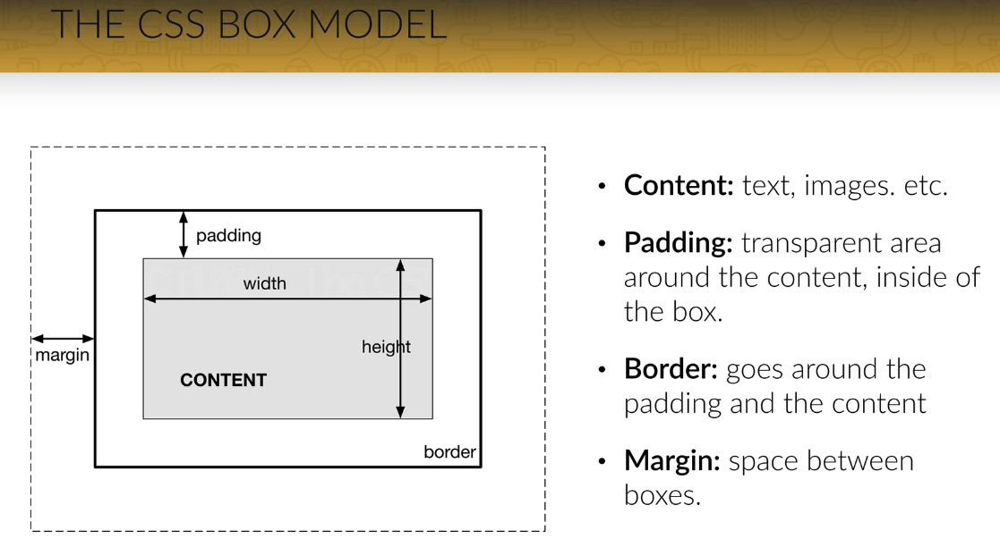

# Build Responsive Real World Websites with HTML5 and CSS3

## Table of contents

* [HTML](#html)
* [CSS](#css)

### HTML

* Headding
* paragraph
* footer

### CSS

* How to use css  
  * inline style // เขียนลงไปที่ Element html ได้โดยตรง  
  * internal Style // เขียน CSS อยู่ตรงส่วนของ head  
  * Externail style // link css มาจากไฟล์ภายนอก  

#### Color

* Hex ***instance*** `#532123`
* rgb เป็นการผสมสีจากแม่สี
* rgba เป็นการเลือกสีได้เหมือน rgb ที่สามารถเลือกความโปร่งแสงของสีได้ ***instance*** `rgba(201, 112, 44, 1)`

#### Class and ID

* class สามารถใช้งานได้หลาย Element  
* Id สามารถใช้งานได้เพียง Element เดียวเท่านั้น

#### CSS box model

#### CSS Layout - The display Property

* Block-level Elements
  * `
`
  * `<h1> - <h6>`
  * `
`
  * `<form>`
  * `<header>`
  * `<footer>`
  * `<section>`
* Inline Elements
  * ``
  * `<a>`
  * ``
* Margin
  * `margin-top: value;`
  * `margin-right: value;`
  * `margin-bottom: value;`
  * `margin-left: value;`
  * `margin: top right bottom left;`
* Padding
  * `padding-top: value;`
  * `padding-right: value;`
  * `padding-bottom: value;`
  * `padding-left: value;`
  * `padding: top right bottom left;`  

> วิธีที่ง่ายที่สุดในการจัดตำแหน่งคือ การใส่สีให้กับ background แต่ละ div ก่อน แล้วค่อยลบออกทีหลัง  
